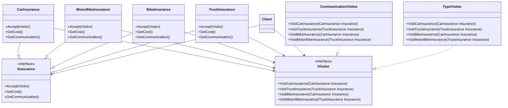
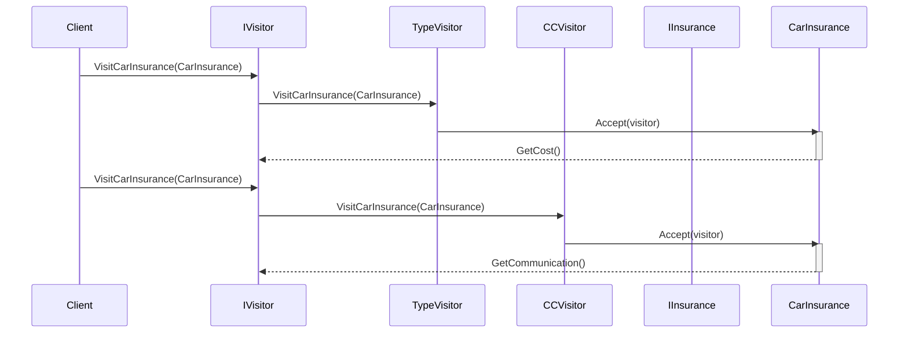

# SWD - The Visitor Pattern 
Working with SOLID principales and the visitor pattern 

## Design 
Working on the design example from [Geek Culture](https://medium.com/geekculture/design-pattern-visitor-pattern-the-most-complicated-design-pattern-with-c-code-sample-f88b608ffb4a)
Expanded Class diagram for the design provided in the example
### Class Diagram
This is a class diagram that illustrates the relationships between the classes involved in a simple insurance system. The system is designed to allow clients to purchase different types of insurance plans, including car, truck, motorbike, and bike insurance plans. The diagram shows the different classes involved in the system and their relationships.

### Sequence Diagram

    
