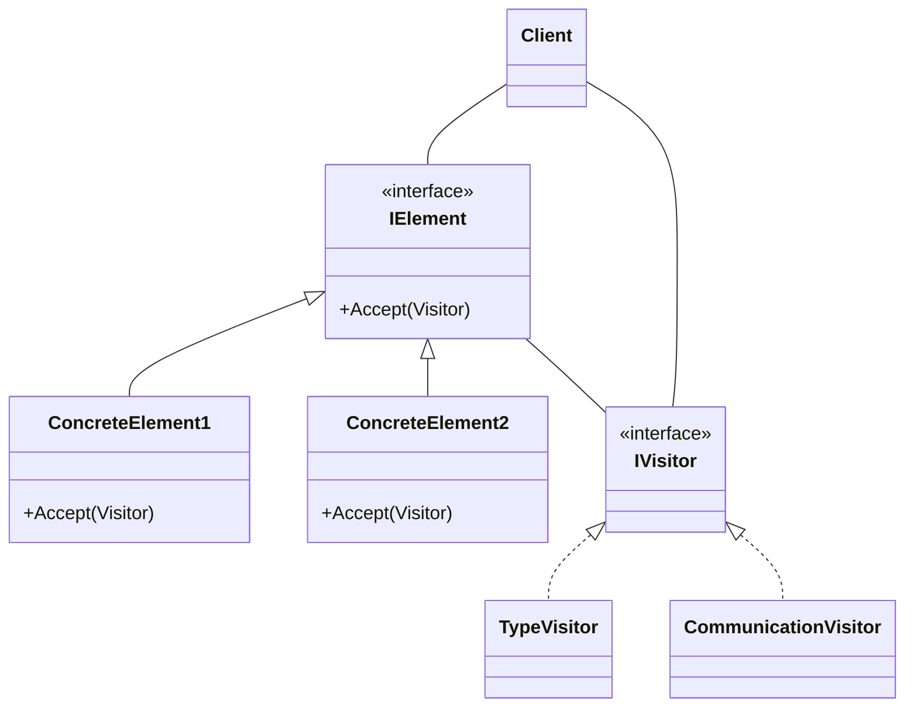
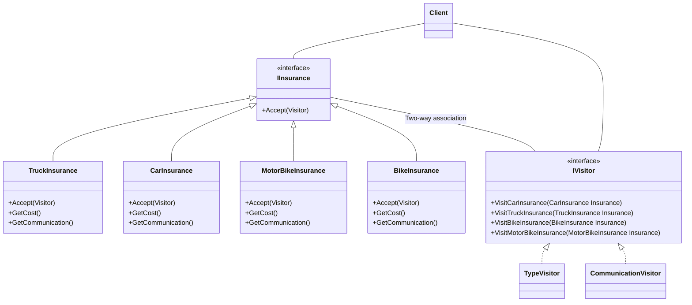
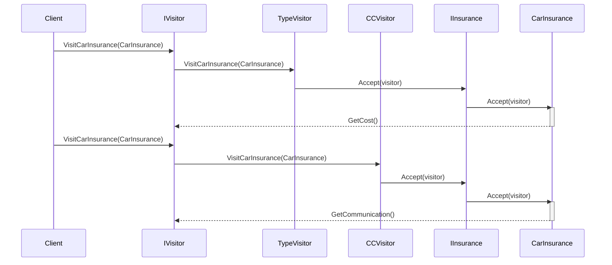

# SWD - The Visitor Pattern 
### Working with SOLID principales and the visitor pattern
The principle behind designing the visitor pattern is illustrated in the diagram below. While we provide a more detailed class diagram later on, this particular diagram depicts the fundamental design of the visitor pattern.

## Design 
Working on the design example from [Geek Culture](https://medium.com/geekculture/design-pattern-visitor-pattern-the-most-complicated-design-pattern-with-c-code-sample-f88b608ffb4a)
Expanded Class diagram for the design provided in the example below

### Class Diagram
This is a class diagram that illustrates the relationships between the classes involved in a simple insurance system. The system is designed to allow clients to purchase different types of insurance plans, including car, truck, motorbike, and bike insurance plans. The diagram shows the different classes involved in the system and their relationships.

### Sequence Diagram

The diagram shows a sequence of interactions between a Client, visitors (IVisitor, TypeVisitor, and CCVisitor), and two classes (IInsurance and CarInsurance).

The Client first visits the CarInsurance using IVisitor, which is passed to TypeVisitor to access the CarInsurance.

The CarInsurance class is then activated and responds to IVisitor's GetCost() method.

The client then visits the CarInsurance using IVisitor again, which is passed to CCVisitor to access the CarInsurance and retrieve its communication using GetCommunication().

The diagram demonstrates the Visitor design pattern, where visitors can access and perform operations on different classes without modifying them.

# Conclusion 

In conclusion, the Visitor pattern is a design pattern that allows for operations to be performed on a collection of objects of different classes. By implementing the Visitor pattern, we can keep the related operations separate from the classes they operate on and avoid modifying these classes when new operations need to be added. Instead, new operations can be added by implementing a new visitor class. This makes the pattern useful for maintaining the SOLID principles of object-oriented design. Overall, the Visitor pattern provides a flexible and maintainable solution for working with complex object structures.
